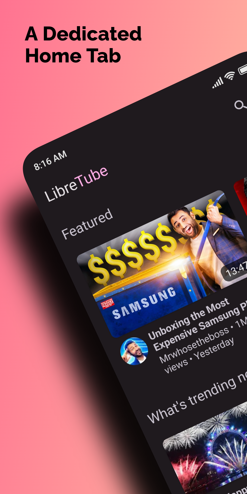
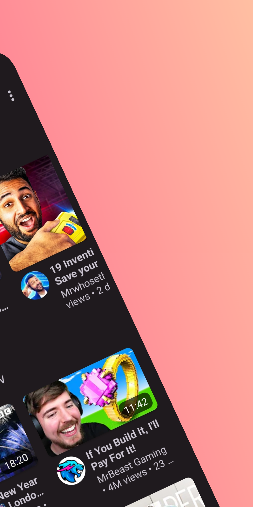

  
  

> **Note**  
> We don't accept feature or bug requests on these platforms. Kindly submit requests only on GitHub.

 

  
📜️ Credits

Readme Design and Banners by [XelXen](https://github.com/XelXen)  
Readme Screenshots by [ARBoyGo](https://github.com/ARBoyGo)  
Readme Emoji is from [openmoji](https://openmoji.org)

  
Icons

[Default App Icon](https://github.com/libre-tube/LibreTube/blob/master/app/src/main/res/mipmap-xxxhdpi/ic_launcher_round.png) by [XelXen](https://github.com/XelXen)  
[Boosted Bird](https://github.com/libre-tube/LibreTube/blob/master/app/src/main/res/mipmap-xxxhdpi/ic_bird_round.png) by [Margot Albert-Heuzey](https://margotdesign.ovh)

<h2 align="left">

About
</h2>

YouTube has an extremely invasive [privacy policy](https://support.google.com/youtube/answer/10364219) which relies on using user data in unethical ways. They store a lot of your personal data - ranging from ideas, music taste, content, political opinions, and much more than you think.

This project is aimed at improving the users' privacy by being independent from Google and bypassing their data collection.

Therefore, the app is using the [Piped API](https://github.com/TeamPiped/Piped), which uses proxies to circumvent Google's data collection and includes some other additional features.

If you have questions or need help, please make sure to read the [FAQ](https://libre-tube.github.io/#faq) before asking for help at the community channels. The [Matrix room](https://matrix.to/#/#LibreTube:matrix.org) is considered as the main communication channel, all other forums or social media accounts are maintained by volunteers from the community but not the developer(s).

<h2 align="left">

Screenshots
</h2>

<h2 align="left">

Features
</h2>

- [x] No Ads
- [x] User Accounts
- [x] Subscriptions
- [x] Subscription Groups
- [x] User Playlists
- [x] Playlist Bookmarks
- [x] Watch/Search History
- [x] SponsorBlock
- [x] DeArrow
- [x] ReturnYouTubeDislike
- [x] Downloads

<h2 align="left">

Contributing
</h2>

Whether you have ideas, translations, design changes, code cleaning or really heavy code changes, help is always welcome. The more is done, the better it gets! Please respect our [Code of Conduct](https://github.com/libre-tube/LibreTube/blob/master/CODE_OF_CONDUCT.md) in order to keep all interactions and dicussions healthy.

You can open and build the project like any other normal Android project by using Android Studio.
If creating a pull request containing code changes, please make sure to format your code with `ktlint --code-style=android-studio -F` before.

Please make sure the title of your pull request and the commit messages follow the [conventional commit types](https://github.com/commitizen/conventional-commit-types/blob/master/index.json) (e.g. `feat: support for xy`).
The most common commit types are "feat", "fix", "refactor", "ci" and "chore".

> **Note**  
> Any issue avoiding the issue template will be ignored and forced to be closed.

<h2 align="left">
Donate
</h2>

Donations can be made at:
* <https://github.com/sponsors/Bnyro>
* <https://liberapay.com/Bnyro>

Contributions in any form are welcome!

<h2 align="left">
📝 Translations
</h2>

<h2 align="left">

Differences to NewPipe
</h2>

With NewPipe, the extraction is done locally on your phone, and all the requests sent towards YouTube/Google are done directly from the network you're connected to, which doesn't use a middleman server in between. Therefore, Google can still access information such as the user's IP address. Aside from that, subscriptions can only be stored locally.

LibreTube takes this one step further and proxies all requests via Piped (which uses the NewPipeExtractor). This prevents Google servers from accessing your IP address or any other personal data. 
Apart from that, Piped allows syncing your subscriptions between LibreTube and Piped, which can be used on desktop too.

If the NewPipeExtractor breaks, it only requires an update of Piped and not LibreTube itself. Therefore, fixes usually arrive faster than in NewPipe.

While LibreTube only supports YouTube, NewPipe also allows the use of other platforms like SoundCloud, PeerTube, Bandcamp and media.ccc.de. 
Both are great clients for watching YouTube videos. It depends on the individual's use case which one fits their needs better.

<h2 align="left">

Privacy Policy and Disclaimer
</h2>

LibreTube aims to protect the privacy of its users. [Our Privacy Policy](/PRIVACY_POLICY.md) gives detailed information on which data the app stores in order to work, how it is being used, and how the project protects your personal information. It is recommended to read the privacy policy of LibreTube as well as the privacy policy of the instance you have chosen inside the app.

### License

LibreTube is Free Software: You can use, study, share and modify it at your will. The app can be redistributed and/or modified under the terms of the
[GNU General Public License](https://www.gnu.org/licenses/gpl.html) version 3 or later published by the Free Software Foundation.

<table><td>
<a href="#start-of-content">↥ Scroll to top</a>
</td></table>

