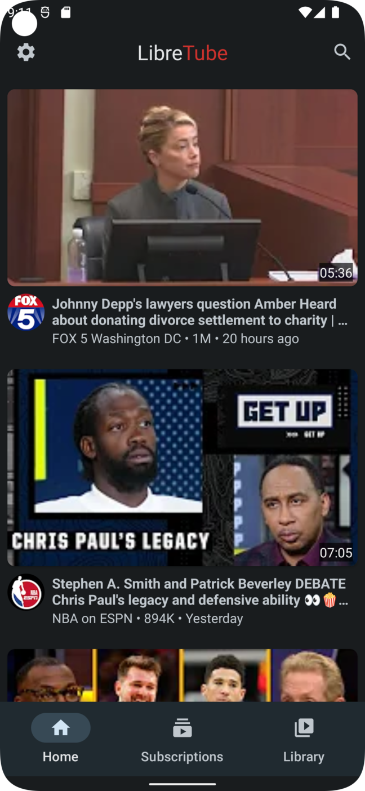
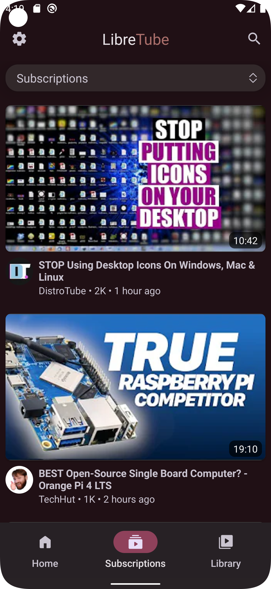
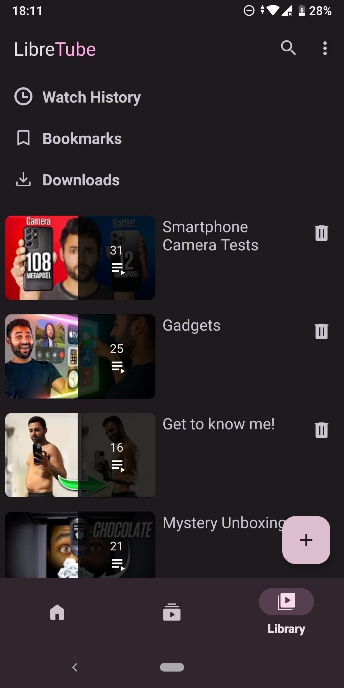
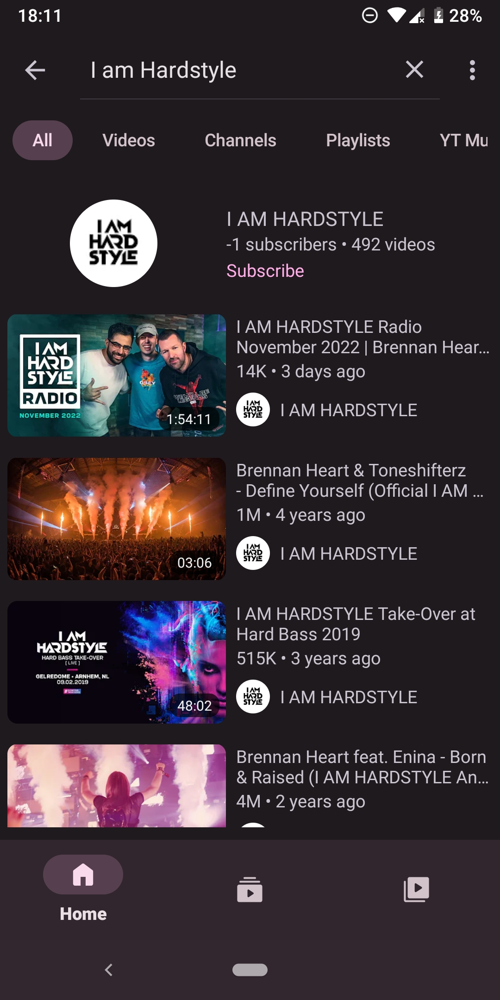
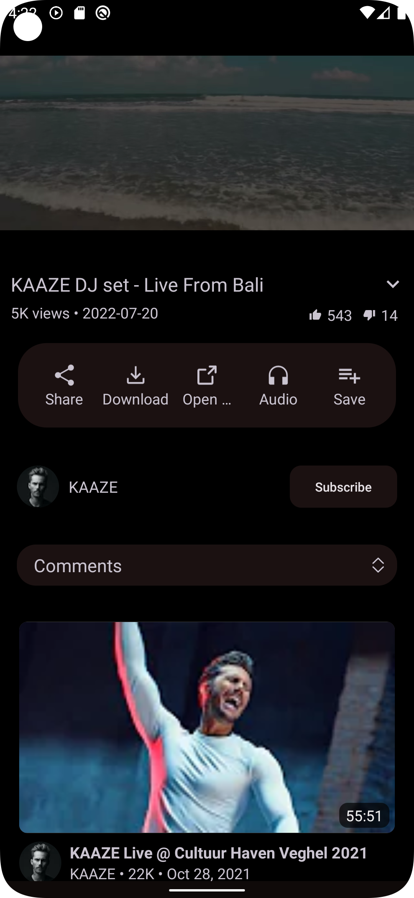
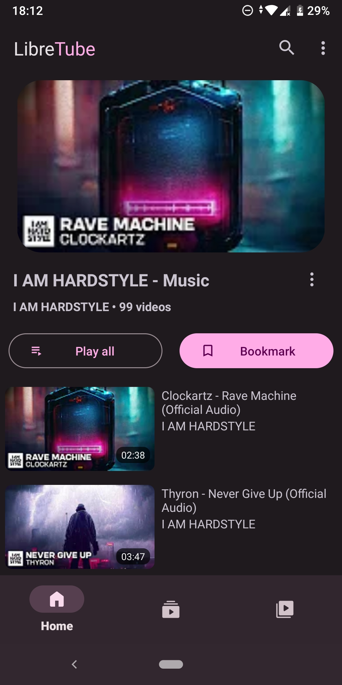
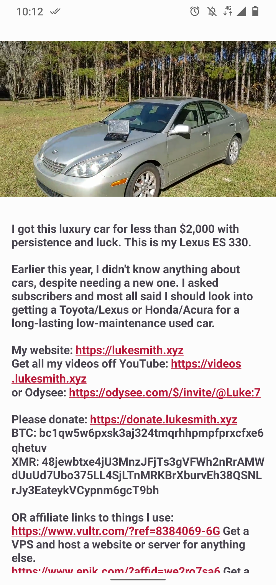
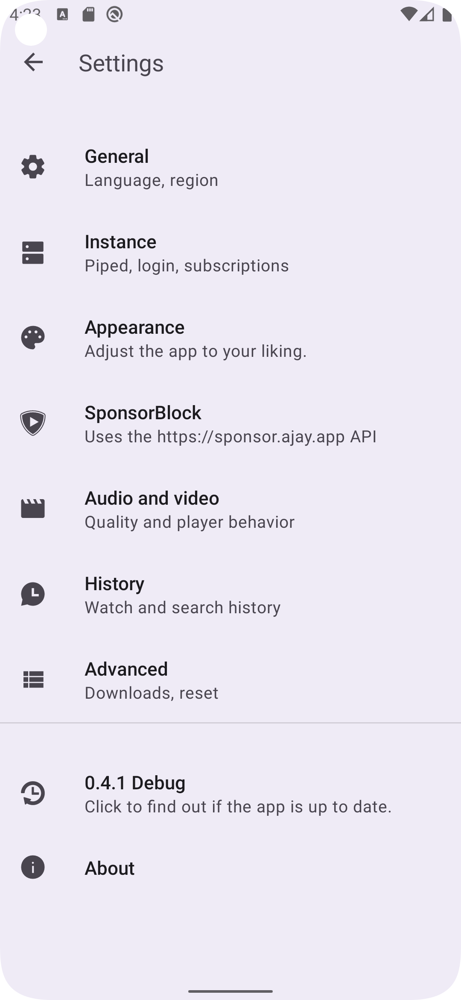

  

 

<h2 align="left">

About
</h2>

YouTube has an extremely invasive [privacy policy](https://support.google.com/youtube/answer/10364219) which relies on using user data in unethical ways. They store a lot of your personal data - ranging from ideas, music taste, content, political opinions, and much more than you think.

This project is aimed at improving the users' privacy by being independent from Google and bypassing their data collection.

Therefore, the app is using the [Piped API](https://github.com/TeamPiped/Piped), which uses proxies to circumvent Google's data collection and includes some other additional features.

> **Warning**  
> The project is still in beta, therefore you may encounter bugs. If you do so, please open an issue via our GitHub repository.

<table><td>
<a href="https://github.com/libre-tube/LibreTube/issues/new?assignees=&labels=bug&template=report_bug.yml">🐞 Report Bug</a>
</td>
<td><a href="https://github.com/libre-tube/LibreTube/issues/new?assignees=&labels=enhancement&template=feature-request.yml">⭐ Request Feature</a>
</td></table>

<h2 align="left">

Screenshots
</h2>

<h2 align="left">

Features
</h2>

| Feature           |     |
| ----------------- | --- |
| User Accounts     | ✅ |
| Subscriptions     | ✅ |
| User Playlists    | ✅ |
| Playlist Bookmarks| ✅ |
| Channel Tabs      | ✅ |
| Search Filters    | ✅ |
| Player Gestures   | ✅ |
| SponsorBlock      | ✅ |
| Comments          | ✅ |
| Captions          | ✅ |

<h2 align="left">

Contributing
</h2>

Whether you have ideas, translations, design changes, code cleaning or really heavy code changes, help is always welcome. The more is done, the better it gets!

If creating a pull request, please make sure to format your code (preferred ktlint) before.

> **Note**  
> Any issue avoiding the issue template will be ignored and forced to be closed.

<h2 align="left">
📝 Translations
</h2>

## 

  
📜️ Credits

Readme Design and Banners by [XelXen](https://github.com/XelXen)  
Readme Emoji is from [openmoji](https://openmoji.org)

##### Icons

- [Default App Icon](https://github.com/libre-tube/LibreTube/blob/master/app/src/main/res/mipmap-xxxhdpi/ic_launcher_round.png) by [XelXen](https://github.com/XelXen)
- [Boosted Bird](https://github.com/libre-tube/LibreTube/blob/master/app/src/main/res/mipmap-xxxhdpi/ic_bird_round.png) by [Margot Albert-Heuzey](https://margotdesign.ovh)

<h2 align="left">

Differences to NewPipe
</h2>

With NewPipe, the extraction is done locally on your phone, and all the requests sent towards YouTube/Google are done directly from the network you're connected to, which doesn't use a middleman server in between. Therefore, Google can still access information such as the user's IP address. Aside from that, subscriptions can only be stored locally.

LibreTube takes this one step further and proxies all requests via Piped (which uses the NewPipeExtractor). This prevents Google servers from accessing your IP address or any other personal data. 
Apart from that, Piped allows syncing your subscriptions between LibreTube and Piped, which can be used on desktop too.

If the NewPipeExtractor breaks, it only requires an update of Piped and not LibreTube itself. Therefore, fixes usually arrive faster than in NewPipe.

While LibreTube only supports YouTube, NewPipe also allows the use of other platforms like SoundCloud, PeerTube, Bandcamp and media.ccc.de. 
Both are great clients for watching YouTube videos. It depends on the individual's use case which one fits their needs better.

<h2 align="left">

Privacy Policy and Disclaimer
</h2>

The LibreTube project aims to provide a private, anonymous experience for using web-based media services. Therefore, the app does not collect any data without your consent.

The LibreTube project and its contents are not affiliated with, funded, authorized, endorsed by, or in any way associated with YouTube, Google LLC, or any of its affiliates or subsidaries. 
Any trademark, service mark, trade name, or other intellectual property rights used are owned by the respective owners.

LibreTube is an open source software built for learning and research purposes.

## License

LibreTube is Free Software: You can use, study, share and modify it at your will. The app can be redistributed and/or modified under the terms of the
[GNU General Public License](https://www.gnu.org/licenses/gpl.html) version 3 or later published by the Free Software Foundation.

<table><td>
<a href="#start-of-content">↥ Scroll to top</a>
</td></table>

